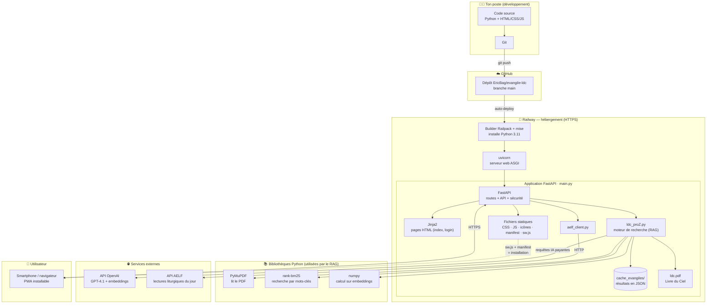

# Architecture du projet — Évangile du jour × Livre du Ciel

Ce document décrit **toutes les briques** du projet (langages, frameworks, services)
et **comment elles sont reliées**, du code jusqu'au smartphone de l'utilisateur.

> 💡 Sur GitHub, le schéma ci-dessous s'affiche directement en image.
> Tu peux aussi ouvrir `architecture.html` dans un navigateur pour le voir en grand.

## Vue d'ensemble

## Comment lire ce schéma

### 1. Le parcours du code (déploiement)
1. Tu écris le **code** sur ton poste et tu l'envoies avec **Git** (`git push`).
2. **GitHub** reçoit le code (dépôt `EricBag/evangile-ldc`, branche `main`).
3. **Railway** détecte le push et lance un **déploiement automatique** :
   - le *builder* (Railpack + `mise`) installe **Python 3.11** ;
   - puis démarre **uvicorn**, le serveur web qui fait tourner l'application.

### 2. Le parcours d'une visite (utilisation)
1. Depuis son **smartphone**, l'utilisateur ouvre le site en **HTTPS** (PWA installable
   grâce à `sw.js` + `manifest.json`).
2. **FastAPI** (`main.py`) reçoit la demande et :
   - sert les **pages HTML** via **Jinja2** et les **fichiers statiques** (CSS, JS, icônes) ;
   - récupère l'**évangile du jour** via `aelf_client.py` → **API AELF** ;
   - lance l'analyse via `ldc_proZ.py` (le **moteur RAG**), qui :
     - lit le **`ldc.pdf`** avec **PyMuPDF**,
     - recherche les passages avec **rank-bm25** (mots-clés) et **numpy** (embeddings),
     - interroge l'**API OpenAI** (GPT-4.1) pour affiner et expliquer ;
   - met les résultats en **cache** (`cache_evangiles/`) pour ne pas repayer OpenAI
     deux fois le même évangile.

## Qui fait quoi — récapitulatif

| Brique | Type | Rôle dans le projet |
|---|---|---|
| **Python 3.11** | Langage | Tout le backend |
| **FastAPI** | Framework web | Cœur de l'app : routes, API, sécurité (mots de passe, rate limiting) |
| **uvicorn** | Serveur ASGI | Fait tourner FastAPI en production |
| **Jinja2** | Moteur de templates | Génère les pages HTML (`index.html`, `login.html`) |
| **HTML/CSS/JS + PWA** | Frontend | Interface ; `manifest.json` + `sw.js` = installation sur smartphone |
| **ldc_proZ.py** | Module maison | Moteur de recherche (RAG) dans le Livre du Ciel |
| **PyMuPDF** | Bibliothèque | Extrait le texte du `ldc.pdf` |
| **rank-bm25** | Bibliothèque | Recherche par mots-clés |
| **numpy** | Bibliothèque | Calculs sur les embeddings |
| **aelf_client.py** | Module maison | Récupère les lectures du jour |
| **API OpenAI** | Service externe | GPT-4.1 + embeddings (analyse, **payant**) |
| **API AELF** | Service externe | Évangile et lectures liturgiques du jour |
| **cache_evangiles/** | Données | Évangiles déjà analysés (évite de repayer OpenAI) |
| **Git** | Outil | Versionne et envoie le code |
| **GitHub** | Service | Héberge le code source |
| **Railway** | Service | Héberge et exécute l'application en ligne (auto-deploy) |
